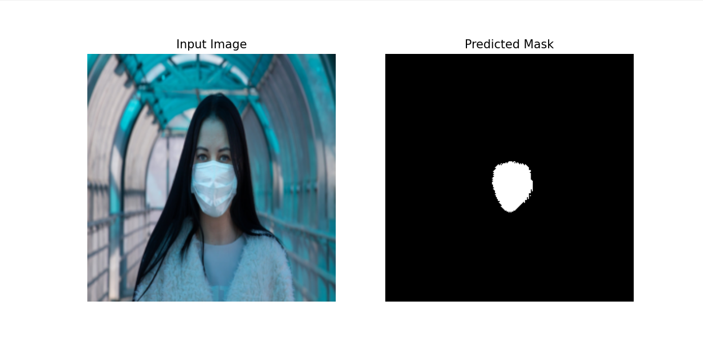
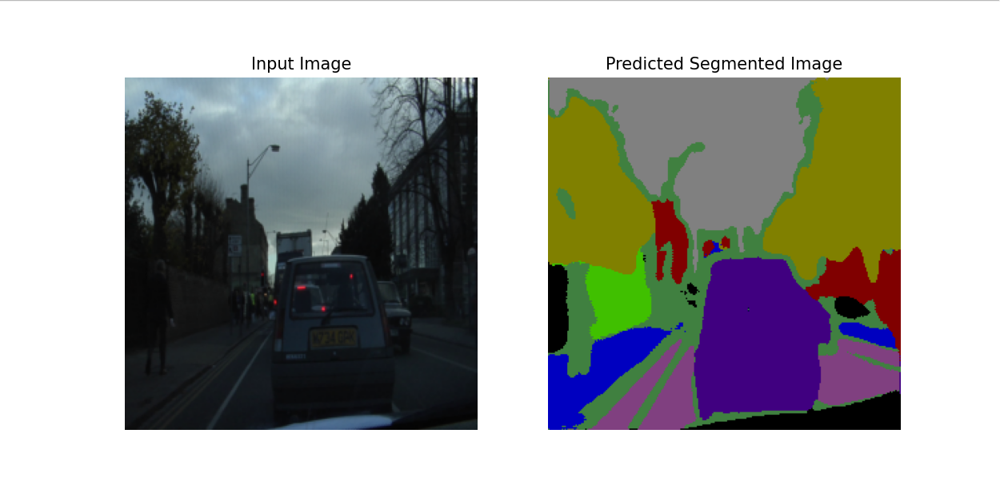

# U-Net Image Segmentation

PyTorch implementation of a U-Net architecture for image segmentation.

The application includes dataset handling, model training, evaluation, and single-image prediction.

---
## Main Features

* U-Net architecture implemented in PyTorch

* Supports:

  * Binary segmentation
  * Multi-class segmentation

* Automatic dataset loading:

  * RGB images
  * Binary masks
  * RGB semantic masks

* Training pipeline:

  * Dataset preparation
  * DataLoader integration
  * Validation loss evaluation

* Inference pipeline:

  * Load trained model
  * Predict segmentation mask for a single image
  * Visualize results

* Automatic CUDA support when available

---

## Repository Structure

```bash
images/
dataset/
    binary_dataset/
        images/
        masks/

    multiclass_dataset/
        images/
        masks/
        class_dict.csv

src/
    dataset.py
    train.py
    predict.py
    unet.py

requirements.txt
README.md
```

---

## Installation

```bash
python 3.11

pip install -r requirements.txt
```

---

## Training

### Binary Segmentation

```python
mode = "binary"
```

### Multi-Class Segmentation

```python
mode = "multiclass"
```

Run:

```bash
python train.py
```
---
## Evaluation

Validation loss is computed after each training epoch.
---

## Prediction

### Binary Segmentation

```python
mode = "binary"
```

### Multi-Class Segmentation

```python
mode = "multiclass"
```

Run:

```bash
python predict.py
```

---

## Outputs

### Training

* Training loss
* Validation loss
* Saved model (.pth)

### Prediction

* Input image
* Predicted segmentation mask

### (a) Binary inference example 



---

### (b) Multiclass inference example 


---

## Supported Datasets

### Binary Segmentation

Dataset structure:

```bash
images/
masks/
```

Example applications:

* Medical anomaly segmentation
* Object extraction

---

### Multi-Class Segmentation

Dataset structure:

```bash
images/
masks/
class_dict.csv
```

The class dictionary maps RGB colors to class labels used during training.

Example applications:

* Road scene segmentation
* Land cover classification
* Urban scene understanding

---

## Notes

* Images are automatically resized before training and inference.
* Binary segmentation uses a single output channel.
* Multi-class segmentation uses one output channel per class.
* RGB masks are automatically converted to class labels during training.
* Predicted class labels are converted back to RGB colors for visualization.
* CUDA acceleration is automatically enabled if available.
